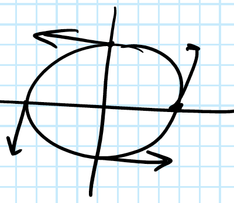
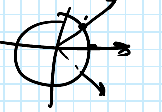

<blockquote>
        What is, is what must be.
        <footer>Leibniz</footer>
</blockquote>

## 0. Degree Theory in $\mathbb{R}^1$

### Motivation
We will begin this exposition into degree theory with a recolection of the _intermediate value thorem,_ and a skech of its famous proof by Cauchy.

**Theorem: The Intermediate Value Theorem**

Let $f(x)$ be a continuous function defined on an interval $[a,b]$ with $f(a),f(b)$ having different signs. The IVT guarantees the existence of some point $c \in [a,b]$ such that $f(c) = 0.$

Without loss of generality, we assume $f(a)$ is negative and $f(b)$ positive. You may be familiar with the bisection method: we consider the sign of the function at the midpoint of our interval $\frac{b-a}{2}.$ If $f(\frac{b-a}{2}) = 0,$ we have found our root so we assume $f(\frac{b-a}{2}) \neq 0.$ If $f(\frac{b-a}{2})<0$ we set $a_1 := \frac{b-a}{2},$ $b_1:= b,$ if, on the otherhand, $f(\frac{b-a}{2})>0$ we set $a_1 = a,$ $b_1:= \frac{b-a}{2}$ the process is then repeated for the interval $[a_1,b_1].$ Such an algorithm will generate a sequence $a,a_1,a_2,\ldots$ at which our function is negative and increasing, and a sequence $b,b_1,b_2,\ldots$ at which our function is positive and decreasing.The difference of our sequences, $\vert a_n - b_n \vert,$ goes to zero and hence must have a common limit $\lim_{n \rightarrow \infty} a_n = \lim_{n \rightarrow \infty} b_n = c$ and as our function is continuous, the sequences $f(a_n)$ and $f(b_n)$ must also have a common limit $f(c).$ Finally, as $f(a_n),$ $f(b_n)$ are each monotonic and bounded by zero, they must converge to zero. Hence, for some $c \in [a,b]$ we have $f(c) = 0.$

This simple argumentation on the existence of a solution for the equation $f(x) = 0$ is the motivation of the entire field of degree theory.

### In which we formulate the most simple degree theory.

Take $\Omega \subset \mathbb{R}^1$ a bounded open set. 
<label for="open_sets" class="margin-toggle">&#8853;</label><input type="checkbox" id="open_sets" class="margin-toggle"/>We know that open sets in $\mathbb{R}^1$ are characterized as (at most) countable union of disjoint open intervals. 

For the sake of simplicity we assume $\Omega$ is a finite disjoint union of open intervals.

Consider a map $f: \bar{\Omega} \rightarrow \mathbb{R}$ with $f(t) \neq 0$ $\forall t \in \partial \Omega.$ We will the pair $(f,\Omega)$ admissible. That is, an admissible pair consists of an open set $\Omega$ and a map $f: \bar{\Omega} \rightarrow \mathbb{R}$ that does not vanish on its boundary.

Denote by $M(\mathbb{R}^1)$ the collection of all admissible pairs.

The formulation of a degree theory on $\mathbb{R}^1$ involves the construction of a map
> $$deg: M(\mathbb{R}^1) \rightarrow \mathbb{Z}$$

satisfying reasonable properties.

**Reasonable Properties of a Degree**

Let $\Omega$ be an open, non-empty, bounded subset of $\mathbb{R}^1$

(1) _Additivity_: 

For subsets $\Omega_1, \Omega_2 \subset \Omega$ with
* Empty intersection: $$\Omega_1 \cap \Omega_2 = \emptyset $$
* Containing all zeros of $$f$$: $$ f^{-1}(0) \subset \Omega_1 \cup \Omega_2$$

then $deg(f,\Omega) = deg(f,\Omega_1) + deg(f,\Omega_2)$

(2) _Homotopy_:

**Definition: Homotopy**

Let $h: [0,1] \times \bar{\Omega} \rightarrow \mathbb{R}$ be a continuous map such that $\forall \lambda \in [0,1]$ $h_{\lambda}: \bar{\Omega} \rightarrow \mathbb{R}$ is $\Omega-$ admissible. Then, we say that $h$ is an admissible homotopy joining $h_0$ and $h_1$

For any $\Omega-$ admissible homotopy $h(\lambda, t)$ we have
> $$deg(h(\lambda, \cdot),\Omega) =$$ constant.

i.e. the degree of of an $\Omega-$ admissible homotopy is independent of $\lambda \in [0,1]$

(3) _Normalization_:

Consider the map $f(t) = t - t_0$ with $t\in \Omega$ and $t_0$ arbitrary. then
> $$deg(f,\Omega) = x = \begin{cases} 1, \quad t_0 \in \Omega \\ 0, \quad t_0 \notin \Omega \end{cases}$$ 

(4) _Existence_:    

For any admissible pair $(f,\Omega),$ if $deg(f,\Omega) \neq 0$ then $\exists p \in \Omega$ such that $f(c) = 0$

With these reasonable properties of a degree theory in mind, we are ready to explicitly define the degree function in $\mathbb{R}^1.$

**<u>Theorem (Degree in $\mathbb{R}^1.$):</u>**

Let $(f,\Omega) \in M(\mathbb{R}^1),$ then, 
> $$deg(f,\Omega) = \begin{cases} \, 1, \qquad \text{if} \; f(a)<0 \; \text{and} \; f(b)>0 \\ -1, \qquad \text{if} \; f(a)>0 \; \text{and} \; f(b)<0 \\ \, 0, \qquad \text{otherwise} \end{cases}$$ 

correctly defines a degree theory in $\mathbb{R}^1.$

For $\Omega = \bigcup_{n=1}^{\infty} (a_n,b_n)$ and $f: \bar{\Omega} \rightarrow \mathbb{R}$ $\Omega-$ admissible,
> $$deg(f,\Omega) = \sum_{n=1}^{\infty} deg(f, (a_n,b_n))$$

**Proposition:** Any polynomial $p: \mathbb{R} \rightarrow \mathbb{R}$ of an odd degree has at least one real root.

*Proof:* Take $p(t) = a_0 + a_1 t + \cdots + a_n t^n,$ with $n$ odd and $a_n \neq 0.$ Then on a sufficiently large ball, $p$ is admissibly homotopic to the leading term $a_n t^n$ such that
> $$ \begin{cases} \text{if} \; a_n > 0 \qquad \text{then} deg(p) = deg(a_n t^n) = 1 \\ \text{if} \; a_n < 0 \qquad \text{then} deg(p) = deg(a_n t^n) = -1 \end{cases} $$

In either case, the degree is different then zero and the existence property guarentees a solution to the equation $p(t) = 0.$

## 1. Degree in $\mathbb{R}^2$

### 1.1 Vector Fields

**<u>Definition(Planar Vector Field):</u>**

Let $\Omega \subset \mathbb{R}^2$ be a set such that for every point $p \in \Omega$ we associate a vector $\Phi(p) \in \mathbb{R}^2.$

We call the map $\Phi: \Omega \rightarrow \mathbb{R}^2$ a vector field over $\Omega$

Any planar vector field $\Phi: \Omega \rightarrow \mathbb{R}^2$ is specified by two _component functions,_ which are real-valued functions $\phi, \psi: \Omega \rightarrow \mathbb{R}$ such that
> $$\Phi(p) = [\phi(p), \psi(p)]$$

**Example: Complex Functions**

Consider the complex function $f: \mathbb{C} \rightarrow \mathbb{C}$
> $$f(z) = z^2$$

Let $z = x+iy,$ then $f(z) = (x+iy)^2 = x^2 - y^2 + i2xy$ such that $f$ is specified by component functions
>  $$f(z) = \begin{pmatrix} x^2 - y^2 \\\ 2xy \end{pmatrix}$$

Indeed, any complex function $f: \mathbb{C} \rightarrow \mathbb{C}$
can be decomposed into real and imaginary component functions
> $$f(z) = f(x+iy) = u(x,y) + iv(x,y) = {u(x,y), v(x,y)}$$

And so, complex functions are naturally expressed as vector fields.

**Example:**
Consider the differential system
> $$\begin{cases} \dot{x} = P(x,y) \\ \dot{y} = Q(x,y) \end{cases}$$

Then, $\Phi = (P,Q)$ is a vector field. In fact, such a system is often called a velocity field.

To describe a vector field as continuous, smooth, differrentiable is equivalent to describing each of its component vectors as respectively continuous, smooth, differrentiable functions.

**Examples: Tangent Field, Fields of Normals**

Consider the unit circle $x^2 + y^2 = 1$ and define the tangent field 
> $$\tau(x,y) = (-y,x)$$

 <figure>
          <label for="figure-1" class="margin-toggle">&#8853;</label><input type="checkbox" id="figure-1" class="margin-toggle"/>We call $\tau$ the *tangent field* as $<\tau, \mathbb{1}> = (-y,x) \cdot (x,y)^{T} = -yx + xy = 0$.
          
</figure>

Alternatively consider the field of external normals
> $$\eta(x,y) = (x,y)$$

 <figure>
          <label for="figure-2" class="margin-toggle">&#8853;</label><input type="checkbox" id="figure-2" class="margin-toggle"/>In other settings this is also known as the identity vector field, for the obvious reason.
          
</figure>

Finally we consider the field of internal normals
> $$\omega(x,y) = (-x,-y)$$

 <figure>
          <label for="figure-3" class="margin-toggle">&#8853;</label><input type="checkbox" id="figure-3" class="margin-toggle"/>At every point on the circle $\omega$ assumes an internal normal.
          
</figure>

### 1.2 Curves

**<u>Definition(Planar Curve):</u>**

A map $\Gamma:[a,b] \rightarrow \mathbb{R}^2$ is called a curve.

A planar curve if given once two component functions are specified
> $$\Gamma(t) = \begin{pmatrix} x(t) \\\ y(t) \end{pmatrix}$$

The image of a curve will be called its trajectory. We define the *reparametrization* of a curve $\Gamma$ to be its composition with any continuous map $\gamma:[0,1] \rightarrow [0,1]$ with $\gamma(0) = 0$ and $\gamma(1) = 1$. It is clear that all parameterizations of a curve share the same trajectory.

A curve is **continuous** $\iff$ its component functions are continuous

A curve is called **closed** if 
> $$\begin{pmatrix} x(a) \\\ y(a) \end{pmatrix} = \begin{pmatrix} x(b) \\\ y(b) \end{pmatrix}$$

A vector field, $\Phi(x,y) = [\phi(x,y), \psi(x,y)],$ may be defined over a curve $\Gamma(t) = [x(t),y(t)].$ In which case the vector field is also paramaterized by the variable $t \in [a,b]$ and can be expressed as a vector function:
> $$\Phi(t) = \begin{pmatrix} \phi(x(t),y(t)) \\\ \psi(x(t),y(t)) \end{pmatrix}$$

### Angular Function

Let $\Phi: [0,1] \rightarrow \mathbb{R}^2$ the continuous vector function associated with a vector field $\Phi$ over some curve $\Gamma$ such that $\Phi(t) \neq \vec{0}$ $\forall t \in [a,b].$ Its angular function, $\Theta : [a,b] \rightarrow [0, 2 \pi],$ returns the angle between the vectors $\Phi(t)$ and $\Phi(a).$ 
<label for="angular_function" class="margin-toggle">&#8853;</label><input type="checkbox" id="angular_function" class="margin-toggle"/>*Problem*: The angular function might be multivalued $\Theta(t) = \Theta(t + n(a-b)),$ instead we want to define $\Theta$ as only the continuous branch on $[a,b]$. 

**Examples: Angular Function of Vector Fields**

Consider the curve with a trajectory of the upper-half unit circle parameterized by
> $$\Gamma(t) = \begin{pmatrix} x(t) \\\ y(t) \end{pmatrix}$ = \begin{pmatrix} cos(t) \\\ sin(t) \end{pmatrix}$$ $$t \in [0, \pi]$$

**(1)** Take the identity vector field 
> $$ \Phi(x,y) = (x,y) t$$

The angular function of $\Phi$ satisfies the equation
> $$tan(\Theta(t)) = \frac{y(t)}{x(t)} = \frac{sin(t)}{cos(t)} = tan(t)$$

Hence $\Phi$ has angular function
> $$\Theta(t) = t$$

**(2)** Take the vector field 
> $$ \Phi(x,y) = (y,-x) t$$
> $$\rightarrow$$
> $$tan(\Theta(t)) = \frac{-cos(t)}{sin(t)} = -cot(t) = -tan(\frac{\pi}{2}-t)$$
> $$\rightarrow$$
> $$\Theta(t) = -(\frac{\pi}{2}-t)$$

**(3)** Take the complex vector field 
> $$ \Phi(x,y) = (x^2 - y^2,2xy) t$$
> $$\rightarrow$$
> $$tan(\Theta(t)) = \frac{2cos(t)sin(t)}{cos^2(t) - sin^2(t)} = \frac{sin(2t)}{cos(2t)} = tan(2t)$$
> $$\rightarrow$$
> $$\Theta(t) = 2t$$

**Properties of the Angular Function:** Let $\Phi$ be a planar vector field,
1. Scalar multiples of $$\Phi$$ all share the same angular function.
2. Vector fields obtained from $$\Phi$$ from rotating every vector by some fixed angle all share the same angular function.
3. In general, if $$\Phi$$ is defined over different parameterizations of the same curve it will have different angular functions.
    * In fact, if we pass from the parameter of a curve $$t$$ to $$\tau:= -t$$ then $$\Theta(\tau) = - \Theta(t)$$
4. If the vectors $$\Phi(a)$$ and $$\Phi(b)$$ point in the same direction then $$\Theta(b)$$ is a multiple of $$2 \pi$$

### Degree

**<u>Definition(Degree of a vector field on a curve):</u>**

Let $\Phi(t) = [\phi(x(t,y(t))), \psi(x(t),y(t))]$ be a vector field defined over the curve $ \Gamma(t) = [x(t),y(t)],$ $t \in [a,b]$ such that $\Phi(t) \neq 0 \forall t$ with angular function, $\Theta(t)$. We define the degree of $\Phi$ on $ \Gamma$ as
> $$ deg(\Phi(t), \Gamma(t)) := \frac{1}{2 \pi} [\Theta(b) - \Theta(a)] = \frac{1}{2 \pi}[\Theta(b)]$$

**Properties of the Degree:** Let $\Phi$ be a vector field defined over the planar curve $\Gamma$
1. The degree of $\Phi$ on $ \Gamma$ is independent of reparameterization so long as the orientation is unchanged.
2. If $$\Gamma = \Gamma_1 \cup \Gamma_2 \cup \cdots \cup \Gamma_n$$ then
    > $$deg(\Phi, \Gamma) = \sum_{i=1}^n deg(\Phi, \Gamma_i)$$
3. If the vectors $$\Phi(a)$$ and $$\Phi(b)$$ point in the same direction then $$deg(\Phi, \Gamma)$$ is an integer.
    > e.g. if $$\Gamma$$ is a closed curve $$\Phi(a)=\Phi(b)$$

**Examples: Degree of Vector Fields on Planar Curves**

Consider the curve with a trajectory of the upper-half unit circle parameterized by
> $$\Gamma(t) = \begin{pmatrix} x(t) \\\ y(t) \end{pmatrix}$ = \begin{pmatrix} cos(t) \\\ sin(t) \end{pmatrix}$$ $$t \in [0, \pi]$$

**(1)** Take the vector field
> $$ \Phi(x,y) = (x,y) t$$

We found already that the pair, $(\Phi, \Gamma),$ has angular function
> $$\Theta(t) = t$$

As $\Phi$ is nonzero on $\Gamma$ we can directly find the degree
> $$deg(\Phi, \Gamma) = \frac{1}{2 \pi}[\pi - 0] = \frac{1}{2}$$

**(2)** Take the vector field
> $$ \Phi(x,y) = (x^2 - y^2,2xy) t$$
> $$\rightarrow$$
> $$\Theta(t) = 2t$$
> $$ \Phi(t) \neq 0 \, \forall t \in [0, \pi]$$
> $$\rightarrow$$
> $$ deg(\Phi, \Gamma) = \frac{1}{2 \pi} [2 \pi - 0] = 1$$

